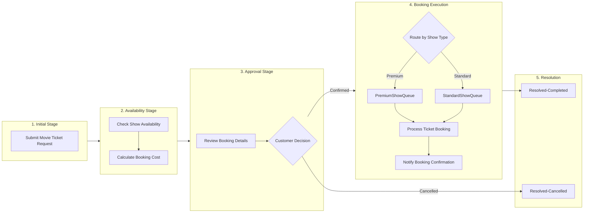

# CineWave Entertainment - Movie Ticket Booking Management Application
## Complete Pega Infinity Implementation Guide

This guide provides a comprehensive, step-by-step blueprint and configuration manual for implementing the **Movie Ticket Booking Management** application in **Pega Platform™ (Pega Infinity v8.x / v25.x)** via App Studio and Dev Studio.

---

## 1. Project Architecture Overview

### Case Type
* **Case Type Name:** `Movie Ticket Request`
* **Class:** `CineWave-Work-MovieTicketRequest`
* **Purpose:** End-to-end automated management of movie ticket reservations, seat availability validation, dynamic pricing calculation, customer approval, show-type routing, and automated email confirmation.

### High-Level Case Lifecycle

---

## 2. Step-by-Step Implementation Manual (Epic by Epic)

### Pre-Requisites: Environment Setup & Application Generation
1. **Access Pega Academy Exercise Instance:**
   - Link: `https://academy.pega.com/mission/business-architect/v8/exercise?`
   - Log in using your registered credentials.
   - Click **Initialize Pega instance for this Mission Exercise**.
   - Click **Launch Pega instance for this Mission Exercise**.
   - Login Credentials:
     - **Username:** `author@uplus`
     - **Password:** `pega123!`
2. **Generate Application via Pega Blueprint / App Studio:**
   - Go to Application Menu $\rightarrow$ **New Application**.
   - Choose **Build from Blueprint** (or import `PEGA_BLUEPRINT_SPECIFICATION.json`).
   - Application Name: `Movie Ticket Booking Management`
   - Organization: `CineWave` | Division: `Entertainment` | Unit: `Operations`
   - Click **Submit** $\rightarrow$ **Go to new application**.

---

### US-001: Submit Movie Ticket Request (Initial Stage)
* **Objective:** Capture initial customer request details and validate inputs.
* **Stage:** `Initial Stage` (Primary)
* **Process:** `Submit Ticket Request Process`
* **Step:** `Submit Movie Ticket Request` (Step Type: *Collect Information*, Persona: *Customer*)
* **Fields to Configure in View:**
  | Field Name | Property Identifier | Type | UI Control / Options | Validation Rule |
  | :--- | :--- | :--- | :--- | :--- |
  | Customer Name | `.CustomerName` | Text (Single line) | Text Input | Required |
  | Customer Email | `.CustomerEmail` | Email | Email Input | Required, Valid Email Format |
  | Customer Phone | `.CustomerPhone` | Phone | Phone Input | Required |
  | Movie Name | `.MovieName` | Text | Dropdown / Text Input | Required |
  | Genre | `.Genre` | Text | Text Input | Optional |
  | Show Date | `.ShowDate` | Date | Date Picker | Required, $\ge$ Current Date |
  | Show Time | `.ShowTime` | TimeOfDay | Time Picker / Dropdown | Required |
  | Show Type | `.ShowType` | PickList | Dropdown (`Standard`, `Premium`) | Required |
  | Number of Tickets | `.NumberOfTickets` | Integer | Numeric Input | Required, Min: 1, Max: 10 |

---

### US-005: Maintain Movie and Show Data (Data Modeling)
* **Objective:** Build reusable Data Objects independent from the case instance.
* **Navigation:** App Studio $\rightarrow$ **Data** $\rightarrow$ **Data Objects and Integrations**.
1. **Data Object 1: `Movie` (`CineWave-Data-Movie`)**
   - Fields: `MovieID` (Key), `MovieName` (Text), `Genre` (Text), `DurationMinutes` (Integer), `Language` (Text), `Rating` (Text).
2. **Data Object 2: `Show` (`CineWave-Data-Show`)**
   - Fields: `ShowID` (Key), `MovieID` (Text), `ShowDate` (Date), `ShowTime` (Time), `ShowType` (Text), `SeatCapacity` (Integer), `AvailableSeats` (Integer), `StandardPrice` (Currency), `PremiumPrice` (Currency).

---

### US-002: Check Show Availability (Availability Stage)
* **Objective:** Verify seat availability and enforce progression validation.
* **Stage:** `Availability` (Primary)
* **Step:** `Check Show Availability` (Step Type: *Collect Information*, Persona: *Booking Agent / System*)
* **Fields Configured:**
  - `SeatCapacity` (Integer, Read-only)
  - `AvailableSeatsCount` (Integer, Required)
  - `SeatAvailabilityStatus` (PickList: `Available`, `Unavailable`)
* **Validation Logic (Validate Rule `ValidateSeatAvailability`):**
  - If `.AvailableSeatsCount < .NumberOfTickets`, trigger error message: *"Requested number of tickets exceeds available seats. Please select another show."*
  - If `.SeatAvailabilityStatus == "Unavailable"`, prevent stage advancement.

---

### US-003: Calculate Booking Cost (Availability Stage)
* **Objective:** Derive `Total Cost` dynamically using business rules / data transforms.
* **Step:** `Calculate Booking Cost` (Step Type: *Data Transform / Automation*)
* **Fields:**
  - `TicketPrice` (Currency)
  - `TotalCost` (Currency)
* **Calculation Logic / Declare Expression:**
  - **Ticket Price rule:**
    - If `.ShowType = "Premium"` $\rightarrow$ `.TicketPrice = 20.00`
    - If `.ShowType = "Standard"` $\rightarrow$ `.TicketPrice = 12.00`
  - **Declare Expression on `.TotalCost`:**
    $$\text{.TotalCost} = \text{.TicketPrice} \times \text{.NumberOfTickets}$$

---

### US-006: Review Booking Details & US-004: Confirm Booking Request (Approval Stage)
* **Objective:** Present a structured read-only summary for Customer verification and capture confirmation decision.
* **Stage:** `Approval` (Primary)
* **Step:** `Review Booking Details` (Step Type: *Collect Information / Approve-Reject*, Persona: *Customer*)
* **UI Layout:**
  - Read-Only Summary Group:
    - Customer Name: `.CustomerName`
    - Movie: `.MovieName` | Genre: `.Genre`
    - Show Timing: `.ShowDate` at `.ShowTime` (`.ShowType`)
    - Ticket Count: `.NumberOfTickets` | Unit Price: `$.TicketPrice`
    - **Grand Total:** `$.TotalCost` (Highlighted in bold)
  - Editable Decision Field:
    - `BookingStatus` (PickList: `Confirmed`, `Cancelled`)
* **Decision Tree / Stage Transition:**
  - If `.BookingStatus == "Confirmed"` $\rightarrow$ Advance to **Booking Execution**.
  - If `.BookingStatus == "Cancelled"` $\rightarrow$ Change Stage to **Resolution** (Status: `Resolved-Cancelled`).

---

### US-009: Define Booking SLA
* **Objective:** Configure case-level service level agreement to ensure timely fulfillment.
* **Navigation:** Case Designer $\rightarrow$ **Settings** $\rightarrow$ **Goal and deadline (SLA)**.
* **Configuration:**
  - **SLA Name:** `MovieTicketRequestSLA`
  - **Goal:** `1 Day`
    - Urgency Increase: `+20`
    - Action: Flag case as *Approaching Goal*.
  - **Deadline:** `2 Days`
    - Urgency Increase: `+30`
    - Action: Increase case priority automatically.
  - **Passed Deadline:** `1 Day` (Repeats 2 times, Urgency `+10`).

---

### US-010: Route Booking Request by Show Type (Booking Execution Stage)
* **Objective:** Route cases automatically to specialized work queues based on `.ShowType`.
* **Stage:** `Booking Execution` (Primary)
* **Work Queues Created:**
  - `PremiumShowQueue@CineWave` (for VIP/Premium auditoriums)
  - `StandardShowQueue@CineWave` (for Standard screenings)
* **Routing Configuration (Router Step / Decision Table `RouteByShowType`):**
  | Condition (`.ShowType`) | Target Work Queue |
  | :--- | :--- |
  | `== "Premium"` | `PremiumShowQueue` |
  | `Otherwise` | `StandardShowQueue` |

---

### US-007: Process Ticket Booking (Booking Execution Stage)
* **Objective:** Allocate seats, generate Ticket ID, and finalize booking status.
* **Step:** `Process Ticket Booking` (Step Type: *Collect Information*, Routing: Routed Work Queue)
* **Fields Configured:**
  - `TicketID` (Text, Auto-generated format: `TKT-<<pyID>>-<<CurrentDate>>`)
  - `SeatNumbers` (Text, e.g., `A1, A2, A3`)
  - `BookingConfirmationStatus` (PickList: `Booked`, `Pending`, `Failed`, Default: `Booked`)

---

### US-008 & Conclusion: Notify Booking Confirmation (Resolution Stage)
* **Objective:** Trigger automated email correspondence to customer upon case resolution.
* **Step:** `Send Email Notification` (Step Type: *Send Email*)
* **Rule Type:** `Rule-Obj-Corr` (`BookingConfirmationNotification`)
* **Recipient:** `.CustomerEmail`
* **Subject:** `Movie Ticket Booking Confirmed - [.pyID]`
* **Template Body:** Uses `CORRESPONDENCE_TEMPLATE.html` containing:
  - Salutation: *Dear [.CustomerName]*
  - Confirmation Notice
  - Dynamic Table: Case ID, Ticket ID, Movie Name, Show Date & Time, Number of Tickets, Seat Numbers, Total Cost
  - Instructions for theatre entry.
* **Case Resolution Status:** `Resolved-Completed`

---

## 3. Checklist of Artifacts & Rules Created

| Rule Name | Rule Type | Applies-To Class | Description |
| :--- | :--- | :--- | :--- |
| `MovieTicketRequest` | Case Type | `CineWave-Work-MovieTicketRequest` | Primary Case Lifecycle |
| `ValidateSeatAvailability` | Rule-Obj-Validate | `CineWave-Work-MovieTicketRequest` | Validates seat count before booking |
| `CalcTotalCost` | Rule-Declare-Expressions | `CineWave-Work-MovieTicketRequest` | Computes `.TotalCost = .TicketPrice * .NumberOfTickets` |
| `SetDefaultPricing` | Rule-Obj-DataTransform | `CineWave-Work-MovieTicketRequest` | Sets ticket price based on Show Type |
| `RouteByShowType` | Rule-Declare-DecisionTable | `CineWave-Work-MovieTicketRequest` | Routes to Premium or Standard WorkQueue |
| `MovieTicketRequestSLA` | Rule-Obj-ServiceLevel | `CineWave-Work-MovieTicketRequest` | 1-Day Goal / 2-Day Deadline SLA |
| `BookingConfirmationNotification` | Rule-Obj-Corr | `CineWave-Work-MovieTicketRequest` | Automated HTML confirmation email |
